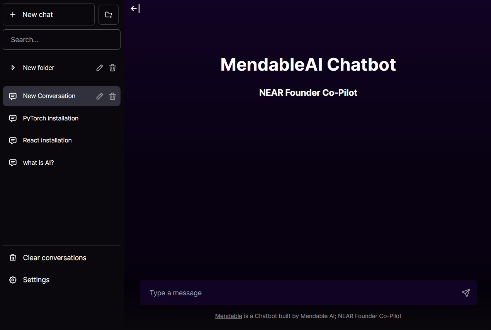

# Mendable Chatbot

Mendable Chatbot is an open source chat UI for AI models.



**Next up:**

## Deploy

**Vercel**

Host

[](https://vercel.com/new/clone?repository-url=https%3A%2F%2Fgithub.com%2FNegasiHaile%2Fmendableai-chatbot)

````

## Running Locally

**1. Clone Repo**

```bash
git clone https://github.com/NegasiHaile/mendableai-chatbot.git
````

**Install Dependencies**

```bash
npm i
```

**Run App**

```bash
npm run dev
```

**Use It**

```bash
OPENAI_API_TYPE=openai
OPENAI_API_HOST=https://api.openai.com
OPENAI_API_KEY= YOUR_OPENAI_API_KEY
OPENAI_API_VERSION='2023-03-15-preview'
```
